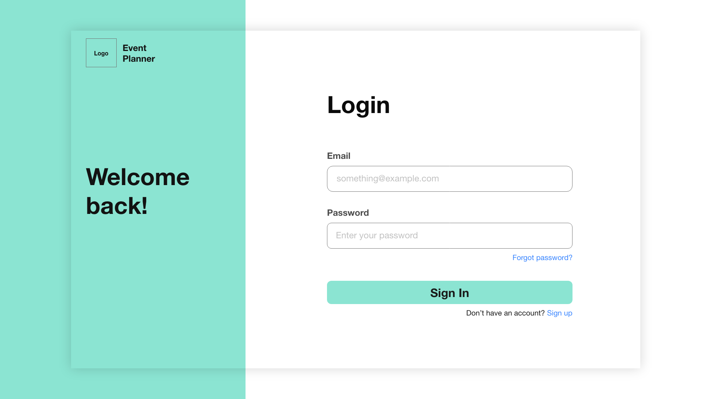
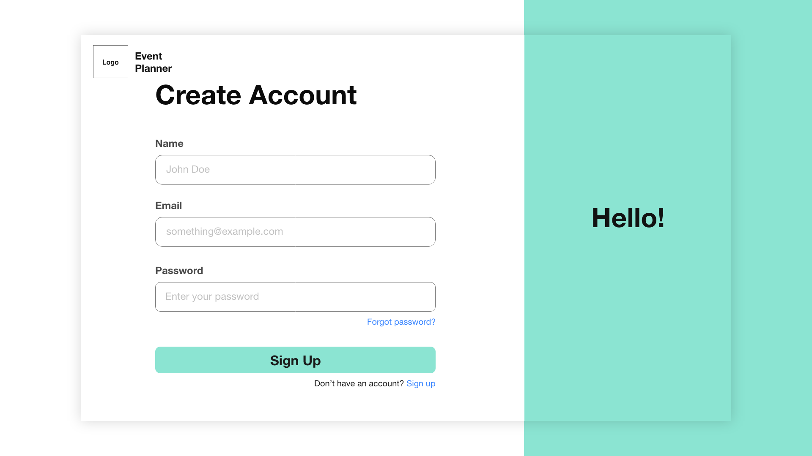
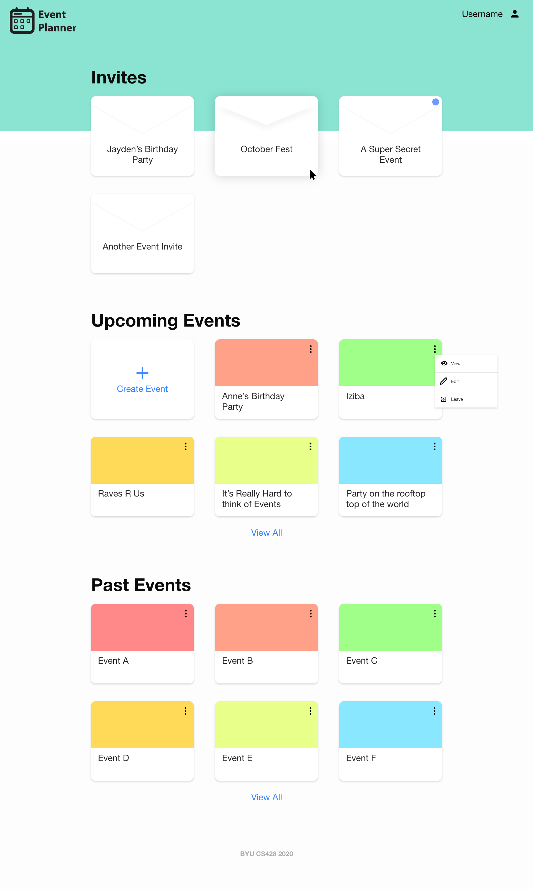

#Screenshots




.png)
_About.png)
_Todo.png)


# Cloning the Project

When you first clone the project, you need to make sure all dependencies are installed for both the client and server sides.
Once you clone the repo, follow these steps:

- Open a new terminal in the client folder
- Run `npm install` and wait for it to finish
- Open another terminal in the server folder
- Run `npm install` inside the server folder and wait for it to finish

## Running the app

To start the server, open a terminal in the server folder and run `node server.js`. This will start the server at localhost:5000
To start the client, open a terminal in the client folder and run `npm start`. This will start the React app at [http://localhost:3000](http://localhost:3000)

I have left the default React readme below for more information.

## Populating the Database

For testing there is a database script that should populate the database with some test data. We should be updating this as features get added as well to keep up.
to run it, all you need to do is navigate to the server folder and run `node test_info.js`. It will provide you various options, but for simplicity I'll state them here:

- `node database_script.js populate` - populate all test user information into database (Username: Test@gmail.com, password: password)
- `node database_script.js clear` - This will clear all test user information from database if you want to start fresh

# API Endpoints

## /login

### POST

Accepts: username, password\
Returns: success, authToken\
Request:

```
{
    "username": "Test@gmail.com",
    "password": "password"
}
```

Response:

```
{
    "success": true,
    "authToken": "xxxxxxxx-xxxx-xxxxx-xxxxxx-xxxxxxxxxxxx"
}
```

## /register

### POST

Accepts: username, password, name\
Returns: success, authToken\
Request:

```
{
    "username": "Test@gmail.com",
    "password": "password",
    "name": "John Doe"
}
```

Response:

```
{
    "success": true,
    "authToken": "xxxxxxxx-xxxx-xxxxx-xxxxxx-xxxxxxxxxxxx"
}
```

## /event

### GET - returns event corresponding to requested eventID

Accepts: authToken (in header), eventID\
Returns: event \
Route path: /event/:eventID \
Request URL: /event/12345
(No request body)

Response:

```
{
    "success": true,
    "event": {
        "collaborators": [],
        "viewers": [
            "Test@gmail.com"
        ],
        "_id": "5f98b1e71487771bbeb14981",
        "eventID": "12345",
        "eventName": "View Only Event",
        "date": "1970-01-01T00:00:00.034Z",
        "__v": 0
    }
}
```

### POST

Accepts: authToken (in header), eventName (required), location, collaborators, viewers, past
Returns: success, message\
Note: We're going to have it return the event object also\
Request:

```
{
    "eventName": "New Event"
}
```

Response:

```
{
    "success": true,
    "message": "Successfully added event to database"
}
```

### PUT

Accepts: authToken (in header), eventID (required), eventName, location, collaborators, viewers, past\
Returns: success, message\
Note: Backend will update any values included in the request to the event with the corresponding eventID
Request:

```
{
    "eventID": "12346",
    "eventName": "No longer a wedding"
    ...
}
```

Response:

```
{
    "success": true,
    "message": "Successfully updated event"
}
```

### DELETE

Accepts: authToken (in header), eventID\
Returns: success, message
Request:

```
{
    "eventID": "cbc5d278"
}
```

Response:

```
{
    "success": true,
    "message": "Event successfully deleted!"
}
```

## /events

### GET - returns all events corresponding to logged in user

Accepts: authToken (in header)\
Returns: list of events
Request:

```
{}
```

Response:

```
{
    "success": true,
    "events": [
        {
            "_id": "5f98b1e71487771bbeb14982",
            "collaborators": [
                "Test@gmail.com"
            ],
            "viewers": [],
            "eventID": "12346",
            "eventName": "Wedding",
            "date": "1970-01-01T00:00:00.034Z",
            "__v": 0,
            "isCollaborator": true,
            "past": false
        },
        {
            "_id": "5f98b1e71487771bbeb14984",
            "collaborators": [
                "Test@gmail.com"
            ],
            "viewers": [],
            "eventID": "12348",
            "eventName": "Funeral",
            "date": "1970-01-01T00:00:00.020Z",
            "__v": 0,
            "isCollaborator": true,
            "past": true
        },
        {
            "_id": "5f98b1e71487771bbeb14981",
            "collaborators": [],
            "viewers": [
                "Test@gmail.com"
            ],
            "eventID": "12345",
            "eventName": "View Only Event",
            "date": "1970-01-01T00:00:00.034Z",
            "__v": 0,
            "isCollaborator": false,
            "past": false
        }
    ]
}
```

